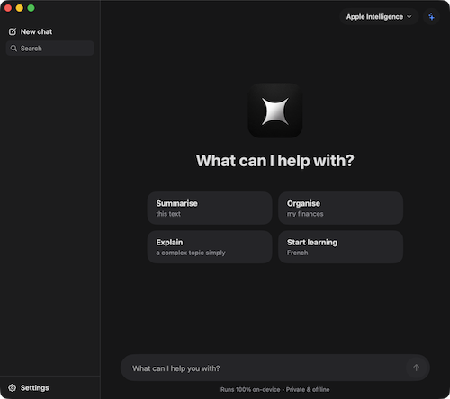
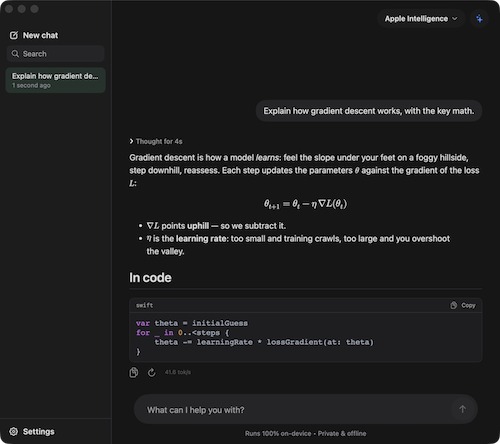
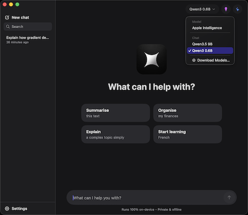
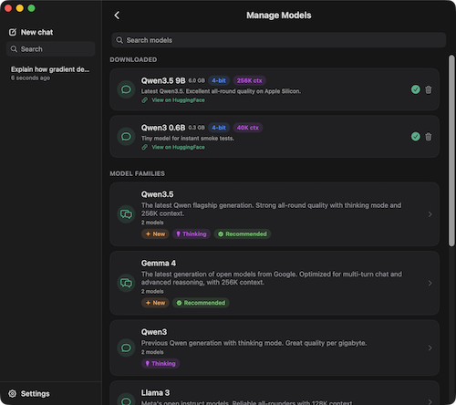

<p align="center">
  <picture>
    
  </picture>
</p>

<h1 align="center">MLX Chat</h1>
<p align="center">
    <b>Run local models on Apple Silicon with MLX</b><br>
    A native macOS chat app for running LLMs fully on-device. Local models run on
    Apple Silicon with <a href="https://github.com/ml-explore/mlx-swift-lm">MLX</a>;
    Apple Intelligence is available as a built-in engine on macOS 26+.
</p>
<p align="center">
    <a href="https://mlxchat.dev/">Download</a> ·
    <a href="https://abayomipo.com/mlx-chat-intelligence-in-a-box/">Read the write-up</a> ·
    <a href="#architecture">Architecture</a>
</p>

## Features

<table>
  <tr>
    <td></td>
    <td></td>
  </tr>
  <tr>
    <td></td>
    <td></td>
  </tr>
</table>

* **Local MLX models**: curated catalog with Qwen, Llama, Phi, Gemma, DeepSeek, and more, plus support for importing any MLX-compatible Hugging Face repo by ID
* **Apple Intelligence engine** (FoundationModels): no downloads required, so you can start chatting immediately on first launch
* Streaming responses with a collapsible thinking phase, per-model thinking toggle, markdown, syntax highlighting, LaTeX math, and artifact preview for live-rendered HTML/SVG in a sandboxed web view
* System-prompt presets: General, Creative, Roleplay, Coding, Reasoning, and Custom, each editable with reset-to-default support
* Global temperature control
* Model manager with download progress, cancel, delete, and disk-usage tools
* Storage in `~/Models`; both plain `<org>/<name>` layouts and the Hugging Face hub cache are recognized
* Auto-unload frees RAM after a configurable idle interval, and memory is actually released (see the performance notes below)
* Light, Dark, and System appearance options backed by a token-based theme in `MLXChat/Support/Theme.swift`

## Installing

Download the `.dmg` from the [MLX Chat product page](https://mlxchat.dev/), then drag the app to Applications.

Requires an Apple Silicon Mac running macOS 26 or later.

## Building from source

Requires Xcode 26+, [XcodeGen](https://github.com/yonaskolb/XcodeGen), and Apple Silicon.

`MLXChat.xcodeproj` is generated and gitignored, so always run `xcodegen generate` after cloning the repo or adding files.

```sh
git clone https://github.com/abayomipopoola/mlx-chat.git
cd mlx-chat
xcodegen generate
xcodebuild -project MLXChat.xcodeproj -scheme MLXChat -configuration Debug \
  -skipPackagePluginValidation -skipMacroValidation build
```

The two skip flags are needed for CLI builds because `mlx-swift` ships a build plugin (`CudaBuild`) and macros that otherwise require interactive trust approval in Xcode.

To run tests, use `xcodebuild … test` with the same flags.

## Architecture

The design follows one rule: **one model in RAM at a time, behind one protocol.** Two very different backends, local MLX models and Apple's on-device foundation model, sit behind a single `ChatEngine` interface, so the UI never needs to know which one it is talking to.

<p align="center">
  
</p>

**A turn, top to bottom.** `ChatController` takes your message and asks `EngineRuntime` for an engine. The runtime owns the single in-RAM slot: a small state machine (*empty → downloading → loading → ready → generating*) that downloads lazily, loads lazily, and evicts the current model before admitting a new one. The downloading itself is `ModelStore`'s job: the curated catalog, Hugging Face imports, progress and cancellation, and honest disk bookkeeping in `~/Models`.

**A turn, bottom to top.** Whatever the runtime returns sits behind `ChatEngine`: `load`, `unload`, and a `stream` that yields answer deltas, thinking deltas, and a completion. As tokens arrive, `ChatController` routes "thinking" tokens away from the answer and flushes visible text to the UI at 10 Hz, because re-parsing markdown hundreds of times a second is how chat apps learn to stutter.

### The two engines

* **`MLXEngine`** wraps `mlx-swift-lm`. It loads quantized weights straight into Apple Silicon's unified memory and keeps a KV-cached `ChatSession` alive across turns (see the performance notes below), so follow-up messages skip re-prefilling the whole conversation.
* **`AppleIntelligenceEngine`** wraps the FoundationModels framework. It seeds a `LanguageModelSession` with the conversation transcript and streams the response. There are no weights to ship and no memory to manage, so the engine is barely a hundred lines, most of it error handling.

### Modules

* `MLXChat/App`: `ChatController` orchestrates turns, including engine resolution, streaming with a 10 Hz UI flush, retry/regenerate, and model-switch warming
* `MLXChat/Engine`: `EngineRuntime` owns the single in-RAM model slot. `MLXEngine` and `AppleIntelligenceEngine` sit behind the common `ChatEngine` protocol, alongside prompt presets and the prompt builder
* `MLXChat/Models`: `ModelStore` handles downloads, disk usage, imports, and the model catalog
* `MLXChat/Views`: SwiftUI views, custom window chrome, hidden titlebar, flat resizable sidebar, and route switching without `NavigationStack`
* `MLXChat/Support/Theme.swift`: the design system, including dynamic light/dark color tokens, metrics, and reusable components

For the story behind these decisions, read the write-up: [Intelligence in a Box](https://abayomipo.com/mlx-chat-intelligence-in-a-box/).

## Performance and memory practices

The app uses the official current APIs on both engine paths:

* **MLX**: `mlx-swift-lm` via `LLMModelFactory.loadContainer`, with a KV-cached `ChatSession` reused across turns. This is the most important MLX performance practice because it avoids re-prefilling the full conversation on every message. Sessions rebuild only when needed, such as after a prompt change, conversation switch, regenerate, or cancel. Temperature updates happen in place on live sessions, and history is trimmed to 70% of the model’s context window before prefill.
* **Memory hygiene**: `Memory.cacheLimit = 20 MB` caps MLX’s Metal buffer cache after load, and `Memory.clearCache()` runs on unload. Without this, unloaded models can leave gigabytes parked in the buffer cache, which is a common source of apparent MLX app leaks. The auto-unload timer, combined with these two calls, ensures RAM is actually released.
* **Apple Intelligence**: uses transcript-seeded `LanguageModelSession`, cumulative-snapshot deduping, friendly handling for context-window and guardrail errors, and temperature clamping to the supported 0–1 range. Sessions are per-turn, so state does not accumulate.
* **General hygiene**: only one model is kept in RAM at a time, streams cancel through `onTermination`, the UI flush loop is throttled to 10 Hz to reduce markdown reparse cost, download tasks clean themselves out of the task dictionary, and every timer/task closure uses `[weak self]`.

## Feedback

Bug reports, feature ideas, and questions are welcome. Please [open an issue](https://github.com/abayomipopoola/mlx-chat/issues).
